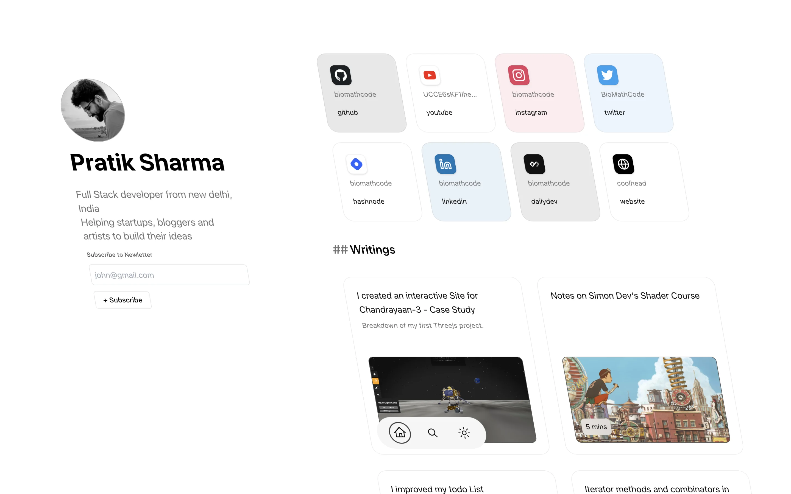

### HMU: Hit me up
HMU is a portfolio template for bloggers, indie developer, any 1 who is on internet and wants to write and sell its goods. The aim is to be composable, adaptable and plug&play.





#### Deploy

Make Sure to update the environment variables

```
HASHNODE_API_KEY={your_api_key}
LEMONSQUEEZY_API_KEY={your_ls_api_key}
NEXT_PUBLIC_HASHNODE_GQL_ENDPOINT=https://gql.hashnode.com
NEXT_PUBLIC_HASHNODE_PUBLICATION_HOST=blog.coolhead.in
NEXT_PUBLIC_LEMONSQUEEZY_STORE=shop.coolhead.in
NEXT_PUBLIC_MODE=development
OLLAMA_BASE_URL=http://localhost:11434
OPENAI_API_KEY={your_openai_key}

```


Vercel: [](https://vercel.com/new/clone?repository-url=https://github.com/biomathcode/hmu)


#### Tech Stack
- Tailwind
- Nextjs
- [Lemon Squeezy](https://www.lemonsqueezy.com/)
- [Headless hashnode](https://github.com/hashnode/starter-kit)
- [ChatGPT](https://chat.openai.com/)
- [Nextjs Themes](https://www.npmjs.com/package/next-themes)

- [Tailwind Animation](https://www.npmjs.com/package/tailwindcss-animate#changing-animation-delay)
- [Lucide React icons](https://lucide.dev/guide/packages/lucide-react)

#### Features
- SEO
- Blogs from hashnode
- Launch Site
- Get Products from Lemon Squeezy
- AI intergrations for writing

---

### Bento Layout

Bento Card Types: Big, Long, medium, small, 
small => 180px, 180px => 360px
gap=> 
long => 80px, 380px;

text sizes;
large = 20px; line-height: 26px, 400
header = 14px; line-height: 16.8px, 400
description = 12px; rgba(0,0,0,0.6), line-height: 16px
buttontext = 12px; 700, white


### Structure of BentoCard

BentoCard will have to BentoContainer, BentoBackground
BentoContainer => BentoBody, BentoHeader, 
BentoBody => will can add custom element like spotify playlist or instagram image grid
BentoImage => will have url and tagline as props
BentoVideo => will have url and tagline as props


## Getting Started

First, run the development server:

```bash
npm run dev
# or
yarn dev
# or
pnpm dev
# or
bun dev
```


### Feedback

- max-width for name as well
- 


### References 
https://dev.to/newbing/how-to-use-lemon-squeezy-as-a-payment-in-nextjs-e46
Infinite scroll: https://www.youtube.com/watch?v=FKZAXFjxlJI

https://tailwindcss.com/blog/tailwindcss-v3-4


Checkout Link for LemonSqueezy = https://www.supaboost.dev/guides/supabase-nextjs-lemon-squeezy/rendering-lemon-squeezy-products